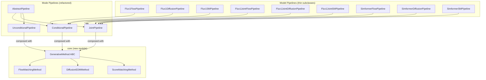

# Pipeline & Loss Consolidation Plan (v3)

> [!IMPORTANT]
> **Breaking release** — no backward-compat aliases. Removed classes get deprecation error stubs.

---

## Architecture



### Design Decisions

| Decision | Rationale |
|---|---|
| **No generic method subclasses** | `ConditionalFlowPipeline` etc. are removed. Users use `ConditionalPipeline(method=FlowMatchingMethod())` directly |
| **Model-specific thin subclasses kept** | `Flux1FlowPipeline`, `SimformerDiffusionPipeline` etc. remain classes for `isinstance`, checkpoint naming, per-model logic |
| **`GenerativeMethod` in `core/`** | Separate from `flow_matching/` and `diffusion/` for clean modularity |
| **Losses owned by strategies** | `_EDMLoss`/`_SMLoss` live in `core/`, created via `method.build_loss(path)`. No separate public loss classes needed |
| **Uniform batch format** | All methods return `(x_0, x_1, t_or_sigma)` from `prepare_batch`. All `path.sample` take `(x_0, x_1, ...)` |
| **No `prior_source`** | `build_sampler_fn` returns just `sampler_fn`. Pipelines use `method.sample_init(key, shape, path)` for initial noise |
| **Custom prior support** | `FlowMatchingMethod(prior=...)` accepts any object with `.sample(key, shape)`. Defaults to `N(0, I)` |
| **Deprecation error stubs** | Removed classes replaced with stubs that raise `DeprecationError` with migration instructions |

---

## What Gets Removed vs Kept

### Removed (replaced with deprecation stubs)

| Removed Class | Migration |
|---|---|
| `ConditionalFlowPipeline` | `ConditionalPipeline(method=FlowMatchingMethod(), ...)` |
| `ConditionalDiffusionPipeline` | `ConditionalPipeline(method=DiffusionEDMMethod(), ...)` |
| `ConditionalSMPipeline` | `ConditionalPipeline(method=ScoreMatchingMethod(), ...)` |
| `JointFlowPipeline` | `JointPipeline(method=FlowMatchingMethod(), ...)` |
| `JointDiffusionPipeline` | `JointPipeline(method=DiffusionEDMMethod(), ...)` |
| `JointSMPipeline` | `JointPipeline(method=ScoreMatchingMethod(), ...)` |
| `UnconditionalFlowPipeline` | `UnconditionalPipeline(method=FlowMatchingMethod(), ...)` |
| `UnconditionalDiffusionPipeline` | `UnconditionalPipeline(method=DiffusionEDMMethod(), ...)` |
| `UnconditionalSMPipeline` | `UnconditionalPipeline(method=ScoreMatchingMethod(), ...)` |
| `ConditionalCFMLoss` | `ContinuousFMLoss` (from `flow_matching.loss`) |
| `ConditionalEDMLoss` | `EDMLoss` (from `diffusion.losses`) |
| `ConditionalSMLoss` | `SMLoss` (from `diffusion.losses`) |
| `JointCFMLoss` / `JointEDMLoss` / `JointSMLoss` | Same core losses |
| `UnconditionalCFMLoss` / `UnconditionalEDMLoss` / `UnconditionalSMLoss` | Same core losses |

### Kept (as thin subclasses)

All model-specific pipelines: `Flux1FlowPipeline`, `Flux1DiffusionPipeline`, `Flux1SMPipeline`, `Flux1JointFlowPipeline`, `Flux1JointDiffusionPipeline`, `Flux1JointSMPipeline`, `SimformerFlowPipeline`, `SimformerDiffusionPipeline`, `SimformerSMPipeline`

---

## Phase 1: Create `core` Module

**Scope:** Purely additive — no existing files changed.

### [NEW] [core/\_\_init\_\_.py](file:///data/users/Aurelio/Github/GenSBI/src/gensbi/core/__init__.py)

Exports `GenerativeMethod`, `FlowMatchingMethod`, `DiffusionEDMMethod`, `ScoreMatchingMethod`.

### [NEW] [core/generative_method.py](file:///data/users/Aurelio/Github/GenSBI/src/gensbi/core/generative_method.py)

```python
class GenerativeMethod(ABC):
    """Strategy encapsulating the generative framework (flow matching, diffusion, SM)."""

    @abstractmethod
    def build_path(self, config: dict): ...

    @abstractmethod
    def build_loss(self, path): ...

    @abstractmethod
    def prepare_batch(self, key, x_1, path): ...

    @abstractmethod
    def get_default_solver(self) -> tuple: ...

    @abstractmethod
    def build_solver(self, model_wrapped, path, solver=None, **kwargs): ...

    @abstractmethod
    def sample_init(self, key, shape, path): ...

    @abstractmethod
    def build_sampler_fn(self, model_wrapped, path, model_extras, **kwargs): ...

    def get_extra_training_config(self) -> dict:
        return {}
```

### [NEW] [core/flow_matching.py](file:///data/users/Aurelio/Github/GenSBI/src/gensbi/core/flow_matching.py)

`FlowMatchingMethod` — uses `AffineProbPath`, `ContinuousFMLoss`, `ODESolver`/SDE solvers, `jax.random.normal` for init.

### [NEW] [core/diffusion_edm.py](file:///data/users/Aurelio/Github/GenSBI/src/gensbi/core/diffusion_edm.py)

`DiffusionEDMMethod(sde="EDM")` — uses `build_edm_path`, `EDMLoss`, `EDMSolver` with EDM/VP/VE schedulers, `path.sample_prior` for init.

### [NEW] [core/score_matching.py](file:///data/users/Aurelio/Github/GenSBI/src/gensbi/core/score_matching.py)

`ScoreMatchingMethod(sde_type="VP")` — uses `build_sm_path`, `SMLoss`, `SMSolver`/`SMPFSolver` with VP/VE, `path.sample_prior` for init.

### Verification

> [!WARNING]
> **Known failure mode:** `mamba run -n gensbi` and `conda run -n gensbi` may silently use the wrong environment. If tests fail unexpectedly, run `mamba deactivate` a couple of times, then `mamba activate gensbi` to ensure the correct environment, and run pytest directly. This applies to **all** verification steps below.

```bash
# New module only — existing tests unaffected
mamba run -n gensbi python -m pytest tests/core/ -x -v --tb=short
```

---

## Phase 1B: Uniform Batch Interface ✅

**Status: DONE.** Unified all three methods to a consistent training data flow:

```
prepare_batch(key, x_1, path)  →  (x_0, x_1, t_or_sigma)
path.sample(x_0, x_1, t_or_sigma)  →  PathSample
loss(model, batch)  →  scalar loss
```

**Changes made:**
- `EDMPath.sample(x_0, x_1, σ)` and `SMPath.sample(x_0, x_1, t)` now take noise directly
- All `prepare_batch` methods return `(x_0, x_1, t_or_sigma)`
- `_EDMLoss`/`_SMLoss` are keyless — call `path.sample(x_0, ...)` directly
- Updated 6 callers in `models/losses/` and all related tests

---

## Phase 1C: Custom Prior & Prior Source Cleanup ✅

**Status: DONE.** Two changes:

1. **Custom prior for flow matching:** `FlowMatchingMethod(prior=...)` accepts any object with `.sample(key, shape)`. Defaults to `_StandardNormal` (i.e. `N(0, I)`).
2. **Eliminated `prior_source`:** `build_sampler_fn` now returns just `sampler_fn`. Pipelines use `method.sample_init(key, shape, path)` for initial noise — one mechanism for all methods.

---

## Phase 2: Create 3 Unified Pipelines

**Scope:** Add `ConditionalPipeline`, `JointPipeline`, `UnconditionalPipeline` — each parameterized by a `GenerativeMethod` strategy.

> [!IMPORTANT]
> **Model-agnostic design.** The unified pipelines accept **any user-provided model** as long as it conforms to the expected interface (e.g., `ConditionalWrapper`'s call signature). Users no longer need to pick a method-specific pipeline class — they pick a pipeline *mode* (conditional/joint/unconditional) and a *method* (flow/diffusion/SM).

> [!NOTE]
> The old classes (`ConditionalFlowPipeline` etc.) are **kept alongside** during this phase, because model-specific pipelines (`Flux1FlowPipeline` etc.) still inherit from them. They will be replaced with deprecation stubs in Phase 4, after the model-specific pipelines are migrated.

### Key prerequisite: uniform loss interface (`_FMLoss`)

The three strategies' `build_loss(path)` methods must return objects with the same call signature:

```python
loss_obj(model, batch, condition_mask=None, model_extras=None) → scalar
```

`_EDMLoss` and `_SMLoss` already use this. `ContinuousFMLoss` uses `(vf, batch, **kwargs)`.
A thin `_FMLoss` wrapper in `core/flow_matching.py` normalizes the FM interface to match.

### [MODIFY] [conditional_pipeline.py](file:///data/users/Aurelio/Github/GenSBI/src/gensbi/recipes/conditional_pipeline.py)

Append `ConditionalPipeline` (old classes preserved):

```python
class ConditionalPipeline(AbstractPipeline):
    """Pipeline parameterized by a GenerativeMethod — works with any model."""

    def __init__(self, model, ..., method: GenerativeMethod, ...):
        self.method = method
        self.path = method.build_path(self.training_config)
        self.loss_obj = method.build_loss(self.path)

    def get_loss_fn(self):
        def loss_fn(model, batch, key):
            obs, cond = batch
            prepared = self.method.prepare_batch(key, obs, self.path)
            return self.loss_obj(model, prepared, model_extras={"cond": cond, ...})
        return loss_fn

    def get_sampler(self, x_o, use_ema=True, **sampler_kwargs):
        sampler_fn = self.method.build_sampler_fn(
            model_wrapped, self.path, model_extras, **sampler_kwargs,
        )
        def sampler(key, nsamples):
            x_init = self.method.sample_init(key, shape, self.path)
            return sampler_fn(key, x_init)
        return sampler
```

### [MODIFY] [joint_pipeline.py](file:///data/users/Aurelio/Github/GenSBI/src/gensbi/recipes/joint_pipeline.py)

Append `JointPipeline`. Adds `condition_mask` in `get_loss_fn`, uses `dim_joint` for noise shape in `get_sampler`.

### [MODIFY] [unconditional_pipeline.py](file:///data/users/Aurelio/Github/GenSBI/src/gensbi/recipes/unconditional_pipeline.py)

Append `UnconditionalPipeline`. No `x_o` in `get_sampler`.

### [MODIFY] [core/flow_matching.py](file:///data/users/Aurelio/Github/GenSBI/src/gensbi/core/flow_matching.py)

Add `_FMLoss` wrapper. `FlowMatchingMethod.build_loss(path)` returns `_FMLoss(path)` instead of `ContinuousFMLoss(path)`.

### [MODIFY] [recipes/\_\_init\_\_.py](file:///data/users/Aurelio/Github/GenSBI/src/gensbi/recipes/__init__.py)

Export new classes alongside old names.

### Verification

```bash
# Old tests must still pass (old classes unchanged)
python -m pytest tests/recipes/ -x --tb=short
# New tests for unified pipelines
python -m pytest tests/recipes/test_unified_conditional_pipeline.py -x --tb=short
```

---

## Phase 3: Simplify Losses

**Scope:** Remove 9 mode-specific loss wrappers from `models/losses/`. Core losses are already handled by the strategies.

> [!NOTE]
> Since Phase 1B, the strategies own their losses via `method.build_loss(path)` which returns `_EDMLoss`/`_SMLoss` (in `core/`) or `ContinuousFMLoss` (in `flow_matching/loss/`). There is **no need** for separate public `EDMLoss`/`SMLoss` classes in `diffusion/losses/` — users never interact with loss objects directly.

### What changes

| Component | Action |
|---|---|
| `models/losses/conditional.py` | Replace 3 classes with deprecation stubs |
| `models/losses/joint.py` | Replace 3 classes with deprecation stubs |
| `models/losses/unconditional.py` | Replace 3 classes with deprecation stubs |

### Deprecation stub target

All 9 stubs point users to the strategy API:

```python
class ConditionalEDMLoss:
    def __init__(self, *a, **kw):
        raise DeprecationError(
            "ConditionalEDMLoss has been removed. "
            "Use DiffusionEDMMethod().build_loss(path) or "
            "ConditionalPipeline(method=DiffusionEDMMethod(), ...) instead."
        )
```

### Verification

```bash
python -m pytest tests/models/losses/ tests/recipes/ -x -v --tb=short
```

---

## Phase 4: Simplify Model-Specific Pipelines & Deprecate Old Classes

**Scope:** Migrate model-specific pipelines to inherit from the new unified classes. **Then** replace old generic classes with deprecation stubs. Deduplicate `parse_training_config`.

### [MODIFY] [flux1.py](file:///data/users/Aurelio/Github/GenSBI/src/gensbi/recipes/flux1.py)

3 thin subclasses of `ConditionalPipeline`. **606 → ~200 lines**.

```python
class Flux1FlowPipeline(ConditionalPipeline):
    pipeline_name = "flux1_flow"

    def __init__(self, train_dataset, val_dataset, dim_obs, dim_cond,
                 ch_obs=1, ch_cond=1, params=None, training_config=None):
        if params is None:
            params = get_default_flux1_params(dim_obs, dim_cond, ch_obs, ch_cond)
        model = Flux1(params)
        super().__init__(
            model=model, train_dataset=train_dataset, val_dataset=val_dataset,
            dim_obs=dim_obs, dim_cond=dim_cond, method=FlowMatchingMethod(),
            ch_obs=ch_obs, ch_cond=ch_cond, params=params,
            training_config=training_config,
            id_embedding_strategy=params.id_embedding_strategy,
        )

    @classmethod
    def init_pipeline_from_config(cls, train_dataset, val_dataset,
                                   dim_obs, dim_cond, config_path, checkpoint_dir):
        params, training_config = parse_model_config(config_path, checkpoint_dir)
        return cls(train_dataset, val_dataset, dim_obs, dim_cond,
                   params=params, training_config=training_config)
```

### [MODIFY] [flux1joint.py](file:///data/users/Aurelio/Github/GenSBI/src/gensbi/recipes/flux1joint.py)

3 thin subclasses of `JointPipeline`. **570 → ~200 lines**.

### [MODIFY] [simformer.py](file:///data/users/Aurelio/Github/GenSBI/src/gensbi/recipes/simformer.py)

3 thin subclasses of `JointPipeline`. `edge_mask` at init + overridable at `sample()`. **651 → ~200 lines**.

```python
class SimformerFlowPipeline(JointPipeline):
    pipeline_name = "simformer_flow"

    def __init__(self, *args, edge_mask=None, **kwargs):
        # ... create model, call super with FlowMatchingMethod() ...
        self.edge_mask = edge_mask

    def get_sampler(self, x_o, edge_mask=None, **kwargs):
        mask = edge_mask if edge_mask is not None else self.edge_mask
        if mask is not None:
            kwargs.setdefault("model_extras", {})
            kwargs["model_extras"]["edge_mask"] = mask
        return super().get_sampler(x_o, **kwargs)
```

### [MODIFY] [recipes/utils.py](file:///data/users/Aurelio/Github/GenSBI/src/gensbi/recipes/utils.py)

Single `parse_training_config` (currently copy-pasted 3×).

### [MODIFY] [recipes/\_\_init\_\_.py](file:///data/users/Aurelio/Github/GenSBI/src/gensbi/recipes/__init__.py)

Update exports: remove old generic pipeline names, add `ConditionalPipeline`, `JointPipeline`, `UnconditionalPipeline`, keep model-specific names.

### Verification

```bash
# Ensure correct env: mamba deactivate && mamba deactivate && mamba activate gensbi
mamba run -n gensbi python -m pytest tests/ -x -v --tb=short
```

---

## LOC Impact

| File | Before | After | Δ |
|---|---|---|---|
| `core/` (NEW) | 0 | ~400 | +400 |
| `conditional_pipeline.py` | 1124 | ~350 | -774 |
| `joint_pipeline.py` | 1211 | ~400 | -811 |
| `unconditional_pipeline.py` | 940 | ~280 | -660 |
| `flux1.py` | 606 | ~200 | -406 |
| `simformer.py` | 651 | ~200 | -451 |
| `flux1joint.py` | 570 | ~200 | -370 |
| `models/losses/` (stubs) | 592 | ~100 | -492 |
| `diffusion/path/edm_path.py` | 129 | ~131 | +2 |
| `diffusion/path/sm_path.py` | 171 | ~170 | -1 |
| **Total** | **~5994** | **~2431** | **-59%** |

---

## Deprecation Stub Pattern

All removed classes follow this pattern:

```python
class _DeprecatedClass:
    """Deprecation stub — raises on instantiation with migration instructions."""
    _message = ""
    def __init__(self, *args, **kwargs):
        raise DeprecationError(self._message)

class ConditionalFlowPipeline(_DeprecatedClass):
    _message = (
        "ConditionalFlowPipeline has been removed in GenSBI 0.2.0. "
        "Use ConditionalPipeline(method=FlowMatchingMethod(), ...) instead."
    )
```

This ensures anyone importing the old name gets a clear error with migration path.
