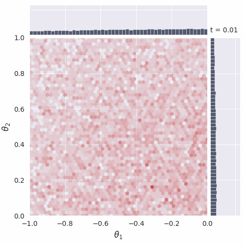
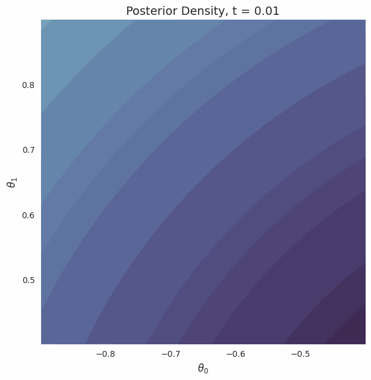

# GenSBI 


```{image} _static/logo.png
  :alt: GenSBI Logo
  :align: center
  :width: 600px
  :class: logo-transparent-bg
```

```{admonition} Beta Release
:class: warning
GenSBI is currently in **Beta**. Expect the API to generally be stable, but be aware that active development is ongoing. We welcome contributions and feedback!
```

## Getting Started

```{admonition} New to GenSBI?
:class: tip

Start here:
1. [Installation](/documentation/installation) - Get GenSBI installed
2. [Quick Start Guide](/getting_started/quick_start) - 15-minute introduction
3. [My First Model Tutorial](/notebooks/my_first_model) - Complete step-by-step walkthrough
```

### Standard Installation (CPU / Compatible)

```bash
pip install git+https://github.com/aurelio-amerio/GenSBI.git
```

### High-Performance Installation (CUDA 12)

If you have a compatible NVIDIA GPU, install with CUDA 12 support for significantly faster training:

```bash
pip install "GenSBI[cuda12] @ git+https://github.com/aurelio-amerio/GenSBI.git"
```

For more installation options, see the [Installation Guide](/documentation/installation).

## Key Documentation Sections

### 📚 Basics

Learn the core concepts and how to use GenSBI effectively:

- **[Conceptual Overview](/basics/overview)** - Understand how GenSBI is structured
- **[Model Cards](/basics/model_cards)** - Choose the right model for your problem
- **[Training Guide](/basics/training)** - Learn how to train models effectively
- **[Inference Guide](/basics/inference)** - Sample from posterior distributions
- **[Validation Guide](/basics/validation)** - Validate your results with SBC, TARP, and L-C2ST
- **[Troubleshooting](/basics/troubleshooting)** - Solve common issues

### 📖 Examples

See GenSBI in action with complete working examples:

- **[My First Model](/notebooks/my_first_model)** - Recommended starting tutorial
- **[SBI Benchmarks](/examples)** - Two Moons, Gaussian Linear, SLCP, and more
- **[All Examples](/examples)** - Full list of notebooks and scripts

All examples are available in the [GenSBI-examples repository](https://github.com/aurelio-amerio/GenSBI-examples).

### 🔧 API Reference

Detailed API documentation for all classes and functions:

- **[API Documentation](/api/gensbi/index)** - Auto-generated API reference

### 👥 Contributing

Want to contribute? Check out the guides:

- **[Contributing Guide](/basics/contributing)** - How to contribute to GenSBI
- **[GitHub Repository](https://github.com/aurelio-amerio/GenSBI)** - Source code and issues

## Examples




Some key examples include:

**Getting Started:**

- [My First Model](/notebooks/my_first_model) - Complete beginner tutorial

**Unconditional Density Estimation:**

- `flow_matching_2d_unconditional.ipynb` [](https://colab.research.google.com/github/aurelio-amerio/GenSBI-examples/blob/main/examples/flow_matching_2d_unconditional.ipynb) <br>
Demonstrates how to use flow matching in 2D for unconditional density estimation.
- `diffusion_2d_unconditional.ipynb` [](https://colab.research.google.com/github/aurelio-amerio/GenSBI-examples/blob/main/examples/diffusion_2d_unconditional.ipynb) <br>
Demonstrates how to use diffusion models in 2D for unconditional density estimation.

**Conditional Density Estimation:**

- `two_moons_flow_simformer.ipynb` [](https://colab.research.google.com/github/aurelio-amerio/GenSBI-examples/blob/main/examples/sbi-benchmarks/two_moons/flow_simformer/two_moons_flow_simformer.ipynb) <br>
Uses the Simformer model for posterior density estimation on the two-moons benchmark.
- `two_moons_flow_flux.ipynb` [](https://colab.research.google.com/github/aurelio-amerio/GenSBI-examples/blob/main/examples/sbi-benchmarks/two_moons/flow_flux/two_moons_flow_flux.ipynb) <br>
Uses the Flux1 model for posterior density estimation on the two-moons benchmark.
- `gaussian_linear_flow_flux1joint.ipynb` [](https://colab.research.google.com/github/aurelio-amerio/GenSBI-examples/blob/main/examples/sbi-benchmarks/gaussian_linear/flow_flux1joint/gaussian_linear_flow_flux1joint.ipynb) <br>
Uses the Flux1Joint model for posterior density estimation on the Gaussian Linear benchmark.
- `slcp_flow_simformer.ipynb` [](https://colab.research.google.com/github/aurelio-amerio/GenSBI-examples/blob/main/examples/sbi-benchmarks/slcp/flow_simformer/slcp_flow_simformer.ipynb) <br>
Uses the Simformer model for posterior density estimation on the SLCP benchmark. 

See the [Examples](/examples) page for the complete list and detailed descriptions.

```{admonition} AI Usage Disclosure
:class: note

This project utilized large language models, specifically Google Gemini and GitHub Copilot, to assist with code suggestions, documentation drafting, and grammar corrections. All AI-generated content has been manually reviewed and verified by human authors to ensure accuracy and adherence to scientific standards.
```

## Citing GenSBI

If you use this library, please consider citing this work and the original methodology papers, see [references](/references).

```bibtex
@misc{GenSBI,
  author       = {Amerio, Aurelio},
  title        = "{GenSBI: Generative models for Simulation-Based Inference}",
  year         = {2025}, 
  publisher    = {GitHub},
  journal      = {GitHub repository},
  howpublished = {\url{https://github.com/aurelio-amerio/GenSBI}}
}
```

```{toctree}
:hidden:
:maxdepth: 1

Get Started! </documentation/index>
Examples </examples>
References </references>
```


